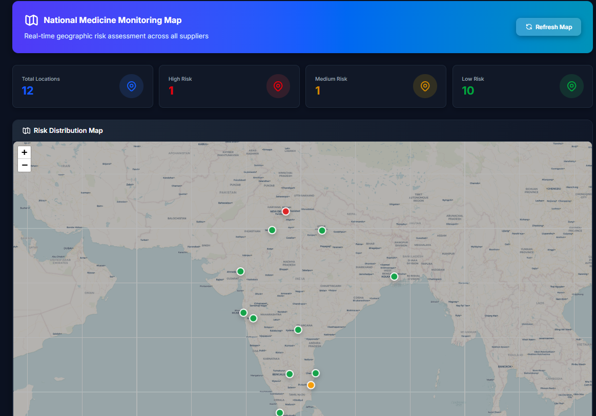
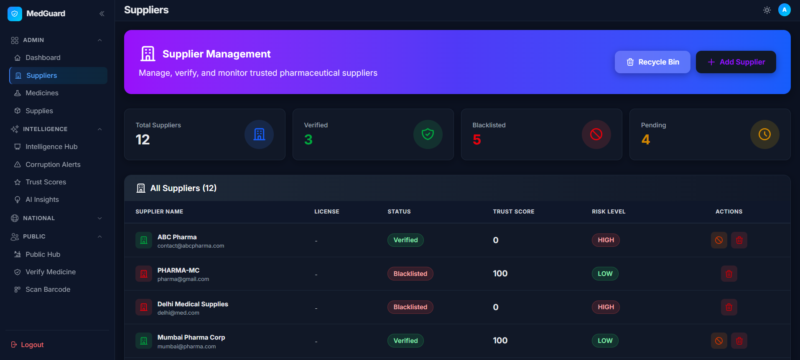
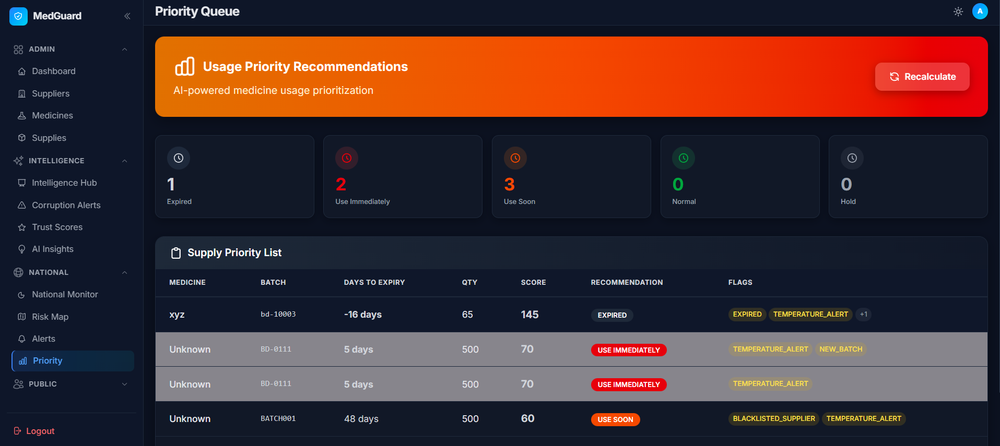

# 🏥 MedGuard AI

> **AI-Powered Medicine Verification & Supply Chain Intelligence Platform**

MedGuard leverages artificial intelligence to combat counterfeit medicines and ensure pharmaceutical supply chain integrity. The platform combines advanced AI algorithms with CDSCO regulatory data to protect public health.

---

## ✨ Key Features

- 🔍 **Public Medicine Verification** - Google-like search for medicine verification with CDSCO integration
- 📦 **Supply Chain Management** - End-to-end tracking with batch intelligence and anomaly detection
- 🤖 **AI-Powered Detection** - Fake detection, corruption patterns, and predictive analytics
- 🗺️ **National Dashboard** - Interactive map visualization of medicine distribution across India
- 👥 **Role-Based Access** - Admin, supplier, and public interfaces with secure authentication

---

## 🛠️ Technology Stack

**Frontend:** React 19 • Vite 7 • TailwindCSS • React Router • Recharts • Leaflet

**Backend:** FastAPI • Python 3 • MongoDB • JWT • Uvicorn

**AI/ML:** scikit-learn • pandas • OpenCV • Pillow • pyzbar

---

## 🚀 Quick Start

### Prerequisites
- Python 3.8+ • Node.js 16+ • MongoDB 4.4+

### Installation

```bash
# Clone repository
git clone https://github.com/yourusername/medguard.git
cd medguard
```

**Backend:**
```bash
cd backend
python -m venv venv
venv\Scripts\activate  # Windows | source venv/bin/activate (Linux/Mac)
pip install -r requirements.txt

# Create .env file with:
# MONGO_URL=mongodb://localhost:27017
# DATABASE_NAME=medguard
# JWT_SECRET=your-secret-key
# JWT_ALGORITHM=HS256
# ACCESS_TOKEN_EXPIRE_MINUTES=30

# Initialize database
python scripts/seed_admin.py

# Start server
uvicorn app.main:app --reload --host 0.0.0.0 --port 8000
```

**Frontend:**
```bash
cd frontend
npm install
npm run dev
```

**Access:**
- Frontend: `http://localhost:5173`
- Backend: `http://localhost:8000`
- Default Login: `admin@medguard.com` / `admin123`

---

## 📁 Project Structure

```bash
medguard/
├── backend/              # FastAPI backend
│   ├── app/
│   └── scripts/          # Seed & test scripts
├── frontend/             # React + Vite frontend
├── docs/                 # Documentation (implementation guide, redesign summary)
├── README.md
└── .gitignore
```

Detailed backend and frontend structure lives inside their respective folders (standard FastAPI and React/Vite layouts).

---

## 📸 Screenshots

<table>
  <tr>
    <td><br/><b>Dashboard Overview</b></td>
    <td><br/><b>National Map</b></td>
  </tr>
  <tr>
    <td><br/><b>Supply Chain</b></td>
    <td><br/><b>Supplier Management</b></td>
  </tr>
  <tr>
    <td><br/><b>Trust Score Analysis</b></td>
    <td><br/><b>Usage Analytics</b></td>
  </tr>
</table>

---

## 📚 API Endpoints

**Base URL:** `http://localhost:8000`

### Authentication
- `POST /auth/login` - User authentication

### Public Verification
- `POST /public/verify/medicine` - Verify by medicine name
- `POST /public/verify/batch` - Verify by batch number
- `POST /public/verify/barcode` - Verify by barcode scan
- `POST /public/verify/image` - Verify by package image

### Supply Chain
- `POST /supply/intake` - Record new supply
- `GET /supply/all` - Get all supplies
- `GET /supply/{id}` - Get specific supply

### Suppliers
- `POST /supplier/add` - Add supplier
- `GET /supplier/all` - List suppliers
- `PUT /supplier/verify/{id}` - Verify supplier
- `PUT /supplier/blacklist/{id}` - Blacklist supplier

### Medicine
- `POST /medicine/add` - Add medicine
- `GET /medicine/all` - List medicines
- `DELETE /medicine/{id}` - Delete medicine

### Analytics
- `GET /analytics/dashboard` - Dashboard data
- `GET /predictive/usage` - Usage predictions
- `GET /trust/{supplier_id}` - Trust score
- `GET /ai/anomalies` - Detected anomalies
- `GET /corruption/patterns` - Corruption patterns
- `GET /map/suppliers` - Supplier locations

---

## 🤖 AI Engines

- **Batch Intelligence** - Pattern recognition and anomaly detection for batch numbers
- **Fake Detection** - Multi-factor analysis combining 8+ signals to identify counterfeits
- **Corruption Detection** - Pattern mining to identify systematic fraud
- **Predictive Analytics** - Demand forecasting and inventory optimization
- **Trust Score** - Multi-dimensional supplier credibility scoring
- **CDSCO Verification** - Real-time lookup against 500+ verified manufacturers
- **Image Analysis** - OCR, tampering detection, and package integrity assessment

---

## 🔒 Security & Compliance

- **Authentication:** JWT-based with bcrypt password encryption
- **Authorization:** Role-based access control (Admin, Supplier, Public)
- **Data Security:** Input validation, injection prevention, CORS configuration
- **Compliance:** CDSCO integration, audit trails, full supply chain traceability
- **API Security:** Rate limiting, input sanitization, HTTPS ready

---

## 🤝 Contributing

Contributions are welcome! Here's how:

1. Fork the repository
2. Create feature branch: `git checkout -b feature/amazing-feature`
3. Commit changes: `git commit -m 'Add amazing feature'`
4. Push to branch: `git push origin feature/amazing-feature`
5. Open a Pull Request

**Code Standards:** PEP 8 for Python • ESLint for JavaScript

---

## 📄 License

This project is licensed under the MIT License.

---

## 📞 Support

- **Documentation:** [Implementation Guide](IMPLEMENTATION_GUIDE.md) • [Redesign Summary](MEDGUARD_REDESIGN_SUMMARY.md)
- **Issues:** [GitHub Issues](https://github.com/yourusername/medguard/issues)
- **Email:** support@medguard.com

---

<div align="center">

### 🏥 Built with ❤️ for Public Health

**MedGuard** - *Protecting Lives, One Medicine at a Time*

⭐ Star us on GitHub — it helps!

</div>
